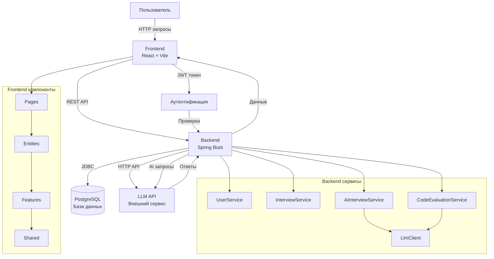

# Кейс VibeCode Jam | Элитные варвары

Платформа для проведения технических собеседований с поддержкой AI-интервью и проверки кода.

## 🚀 Быстрый запуск

### Требования

- Docker и Docker Compose
- Переменная окружения `LLM_API_KEY` с ключом API для LLM

### Запуск приложения

1. Установите переменную окружения с ключом API:

```bash
export LLM_API_KEY=your_llm_api_key_here
```

2. Запустите все сервисы через Docker Compose:

```bash
LLM_API_KEY=your_llm_api_key_here docker compose up --build
```

или вот так:

```bash
cmd /c "set LLM_API_KEY=ВАШ_КЛЮЧ && docker compose up --build"
```

3. После запуска будут доступны:

- **Frontend**: http://localhost:5173
- **Backend API**: http://localhost:19091
- **PostgreSQL**: localhost:5432

### Остановка

```bash
docker compose down
```

Для полной очистки данных (включая базу данных):

```bash
docker compose down -v
```

## 📋 Структура проекта

```
hackaton-t1/
├── backend/
│   └── jam-backend/          # Spring Boot приложение
│       ├── src/
│       │   └── main/
│       │       ├── java/     # Java код
│       │       └── resources/ # Конфигурация
│       └── Dockerfile
├── frontend/                  # React + Vite приложение
│   ├── src/
│   │   ├── app/              # Конфигурация приложения
│   │   ├── entities/         # Бизнес-сущности
│   │   ├── features/         # Функциональные возможности
│   │   ├── pages/            # Страницы
│   │   ├── shared/           # Общие компоненты
│   │   └── widgets/          # Виджеты
│   └── Dockerfile
└── docker-compose.yml         # Конфигурация Docker Compose
```

## 🔄 Архитектура взаимодействия



## 🔐 Аутентификация

Приложение использует JWT токены для аутентификации:

1. **Регистрация**: `POST /api/auth/register`
2. **Вход**: `POST /api/auth/login` → получаете JWT токен
3. **Использование**: Добавьте заголовок `Authorization: Bearer <token>` к защищенным запросам

## 📝 Основные функции

### 1. Управление пользователями

- Регистрация и вход
- Просмотр профиля и статистики
- Управление данными пользователя

### 2. Собеседования

- Создание собеседований (AI и ручные)
- Просмотр списка собеседований
- Прохождение AI-собеседований с вопросами и заданиями на код

### 3. AI-собеседования

- Автоматическая генерация вопросов через LLM
- Поддержка вопросов с кодом (Monaco Editor)
- Оценка ответов AI
- История диалога

### 4. Проверка кода

- Отправка кода на проверку
- Детальная оценка кода через LLM
- Получение рекомендаций по улучшению

### 5. Защита контеста

- Блокировка копирования/вставки
- Обнаружение DevTools
- Предупреждения при попытке покинуть страницу

## 🛠️ Разработка

### Локальная разработка (без Docker)

#### Backend

```bash
cd backend/jam-backend
mvn spring-boot:run
```

Требуется:

- Java 21+
- Maven
- PostgreSQL (запущенный локально или в Docker)

#### Frontend

```bash
cd frontend
npm install
npm run dev
```

Требуется:

- Node.js 20+
- npm или yarn

### Переменные окружения

#### Backend

- `SPRING_DATASOURCE_URL` - URL базы данных
- `SPRING_DATASOURCE_USERNAME` - Имя пользователя БД
- `SPRING_DATASOURCE_PASSWORD` - Пароль БД
- `SECURITY_JWT_SECRET` - Секретный ключ для JWT
- `LLM_API_KEY` - Ключ API для LLM сервиса
- `LLM_BASE_URL` - Базовый URL LLM API (по умолчанию из application.properties)

#### Frontend

- `VITE_API_URL` - Полный URL API (опционально)
- `VITE_API_PORT` - Порт API (по умолчанию 19091)
- `NODE_ENV` - Окружение (production/development)

## 📚 API Документация

https://github.com/DjonniStorm/vibecode-jam/blob/master/backend/jam-backend/api.md

## 🧪 Тестирование

При первом запуске приложения автоматически создаются тестовые данные:

- Системный пользователь (`system@jam.local`)
- 8 публичных AI-собеседований (4 с вопросами, 4 с заданиями на код)

## 📦 Технологии

### Backend

- Spring Boot 3.x
- Spring Security (JWT)
- PostgreSQL
- Maven

### Frontend

- React 18
- Vite
- TypeScript
- Mantine UI
- React Query
- React Router
- Monaco Editor
- Unhead
- Nginx

## 📄 Лицензия

Проект создан для хакатона VibeCode Jam.
